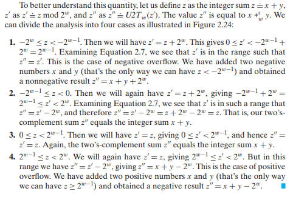

Useful topics in CSAPP

<!--more-->

# update log
**Prelude**: The notes provided here are not simply copied from the textbook. I select topics that suprise me, focusing on comparing the different explanations or
examing practical applications. So I would omit many conventional definitions and derivations. I wil be very happy if these notes assist you in comprehending various concepts or understanding the underlying reasons.

9.12:

# Representing and Manipulating information

## Two's-Complement Encodings

The definition in the book is new to me:
> For vector $\overrightarrow{x} = {x_{w-1}, x_{w-2}, \dots, x_0}$:
> $$B2T_w(\overrightarrow{x}) = -x_{w-1}2_{w-1} + \sum_{i=0}^{w-2}x_i 2^i$$

It means that when the most significant bit is 1, the number is counted from $-2^{w-1}$

As usually observed in Chinese textbook, *reverse encoding* is introduced to illustrate the concept of two's complement encoding.
In *reverse encoding*, for a non-negetive number $x  = {0, x_{w-2}, \dots, x_0}$, the reverse encoding retains the same bits as $x$, but for negtive $x = {1, x_{w-2}, \dots, x_0}$, get reversed by bit except for the most significant bit representing for the sign.

Based on *reverse encoding*, the 2's complement encoding of non-negtive numbers preserves the same bits. However, for negative numbers, this encoding is obtained by adding 1 to *reverse encoding*.

This is not intuitive, but we can establish the connection between this complex procedure with the origin definition, obtain the 2-complement encodings of -x, where x is non-negtive number.

For a non-negative number $x$ with 2's complement encoding of ${0, x_{w-2}, \dots, x_0}$, suppose a negative number $y = x$ whose 2-complement encoding is ${1, y_{w-2}, \dots, y_0}$.
So we have:
$$-2^{w-1} + \sum_{i=0}^{w-2} y_i 2^i = -x$$

So the value of bits, except for the sign bit, is actually $2^{w-1} - x$. And the process of "reverse bit and add 1" euqals to "{1, 1, ..., 1} - x + 1". They are the same.

We can also find that the unsigned value of the 2's complement encoding is $2^w - x$. That's what "2's complement" represents.

### Shfiting

As it is widely known that it's dangerous to convert between signed and unsigned value.
And based on the 2's complement encoding, here're some behaviours:
```c++
void print(unsigned char *p, int len) {
    for (int i = 0; i < len; i++) {
        printf("%.2x,", *p);
        p+=1;
    }
}

int y = 2147483648;
// y = 0x80000000 = -1;
// print: 00, 00, 00, 80

y <<= 1;
// y = 0;

y = -1;
// 0xffffffff
y >>= 1;
// 0xffffffff still -1

y = 2147482647
// y = 0x7fffffff the largest number of int
y <<= 1;
// y = 0xfffffffe = -2
```

We can also find the operating system is little-endian.

## Integer Arithmetic

### Unsigned Arithmetic

Unsigned Addition is actually modular addition, which forms an *abelian group*.
Although I know nothing about the theory of group, I would take it natural that the modular addtion has an identity element 0 and every element has an additive inverse,
just like what we see in natrual numbers and vectors in linear algebra.

The following discussion is based on the hypothesis that $x$ and $y$ are unsigned integers represented by $w$ bits.

- How to detect overflow?

We know that $x + y \geq x$ if there's no overflow. And at "most" time the result will be smaller than $x$ if an overflow occurs.
But is it possible that we may choose a $y$ that $x + y > 2^w > x$ ? No, unless $y > 2^w$ that will never happen.

So simply `return x + y < x;` is enough.

- What's the additive inverse of $x$?

This actually has been discussed in the previous section, "the unsigned value of the 2's complement encoding is $2^w - x$".
Because the 2's complement encoding of non-negtive value is the same to its binary representation ,and there's no concept of "nagative" here,
so everything is suitable here.

But this proof is still too complicated. A intuitive explanation is, in unsigned addition we have $2^w = 0$. $x + (-x) = 2^w$, so $(-x) = 2^w - x$.

### Two's Complement Arithmetic

The textbook dedicates to build the relationship between number, code and arithmetic. There're many aspects when discussing computation on two's complement encoding.

It's a lot of gossip here, hope I can make my point...

>1. Calculation on numbers. This is the same as what we do on paper. -128 + (-1) should be -129 instead of 127.
>2. Encoding numbers to bits. This process is a function or mapping. The actual calculation working on the mapped bits.
>3. Calculation on bits. No matter what kind of encoding method the computer uses, the arithmetic on binary bits remains the same. So it's natrual to add an extra abstract layer,
>converting mapped bits to unsigned integer. The unsigned integer arithmetic follows the intuitive rules with modular.
>
>So we can make a workflow of this procecure:
>
>x , y -> two's complement code -> unsigned code -> operate -> two's complement code -> result number z
>
>1. Encoding number to two's complement form. This is what computer stores in the memory.
>2. Converting two's complement code to unsigned code. In fact the elements in the bits are not changed. But the operations on bits are intuitive for unsigned code instead of two's >complement code.
>3. Applying calculation on bits.
>4. Converting the result bits to numbers. Just following the definition of two's complement encoding.
>
>So here comes the property of two's complement arithmetic:
>
>1. Recalling the definition of two's complement encoding, we have the formular converting two's complement encoding to unsigned: $T2U(x) = x + bit_{w-1} 2^{w}, U2T(x) = x - bit_>{w-1}2^w$.
>  - It may be a little bit confusing. What is $x$? $x$ is the value reprensented by different encoding method. So the domain is actually different in the two formulars above.
>  - $U(x), T(x)$ here represents the value of usigned form no matter which encoding method it is.
>2. Notice that negative number $(-x)$ represented in unsigned number is $2^w - x$. Eg. $T2U(-128) = 128$

Sigh, I find I can't explain better than the textbook. And I also suggest that you can derivate the following cases by yourself. It will help you understand these encodings better.



Notice that two's complement arithmetic also forms an *abelian group*. You may be curious about what is the inverse of -128, it's itself. (Ok the textbook mentioned this...)

**And a good practice is, try to extend these theory to *inverse code*, which only use the most significant bit as sign bit, and find out why it's not a good choice for
number representation in computer.**

### Multiplication and Division

Multiplication and division of unsigned integer is very simple, so I just omit them here.

The derivation of the equality of multiplication between unsigned and 2'complement representation is similar to the two's complement arithmetic. It worth reading and derivating on your own.

And I want to provide an intuitive perspective on the division of two's complement of negative number.

It's obviously that the result of shifting integer is rounded down from the exact result in real number.
But what we need is actually the "truncating result". Truncating $45.5$ is the same as $round(45.5) = 25$. But for negative number, $round(-25.5) = -26 != 25$.
So we can use some bias to make it.

For a bit vector with length $w$: ${b_{w-1}, \dots, b_0}$. If we shift it right k bit, it will become ${b_{w-1}, \dots, b_k . ,b_k-1 , b_0}$, where the sub-bits ${b_k-1 , b_0}$ forms the dicimal part. If none of these sub-bits is $1$, the result is what we want. But if one bit equals to 1, the decimal part is larger than 0. At this time we can simply add 1 to the final rounding result.

So the problem turns to "Is there any bits equaling to 1 in the last k bits?". So we just add an extra bias $(1 << k) - 1$, which will contributes to the $b_k$ bit if such bit exists.

